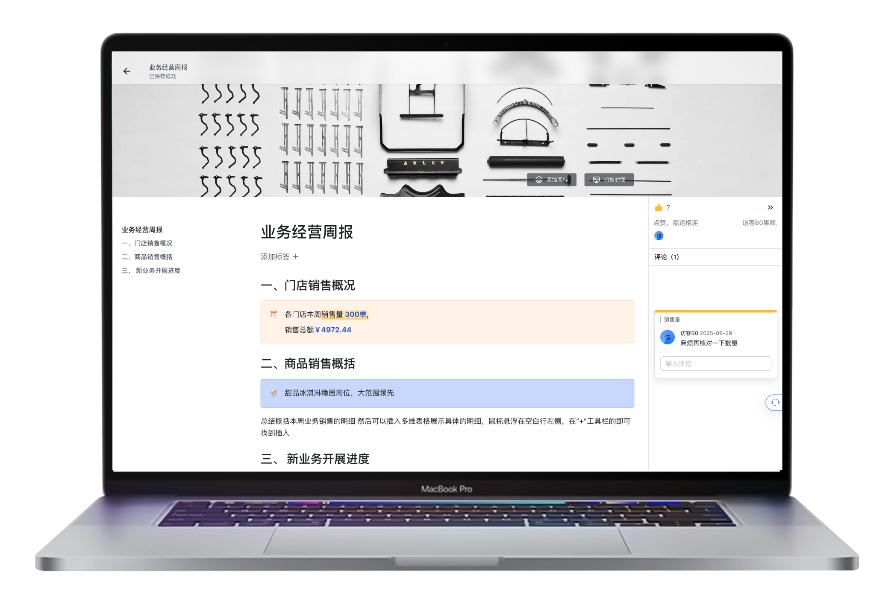

 
<strong>Lumi - local-first, collaborative knowledge repo</strong>
  

## 💯 Introduction
Lumi is a local-first personal knowledge management system that works seamlessly even when offline. It supports real-time collaboration, Markdown editing, and block-level references, providing a Notion-like flexible page structure. Lumi enables individuals and teams to efficiently organize and manage knowledge, regardless of network connectivity.

## 🌟 Features
* Document & Wiki knowledge base
* Multi-space management
* Rich text blocks
    * Text block
    * Code block
    * Database block
        * Table view
        * Kanban view
    * Multi-column layout block
    * Multi-level heading block
    * Embedded web page block
    * Image & video block
    * Quote block
    * Table block
    * List block
        * Unordered list
        * Ordered list
        * Task list
        * Foldable list
* Inline blocks
    * @Mention
    * Emoji
* Extensive keyboard shortcuts
* Text selection comments
* Tag management
* Markdown

